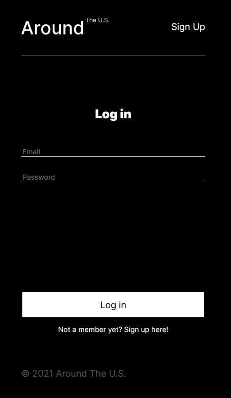
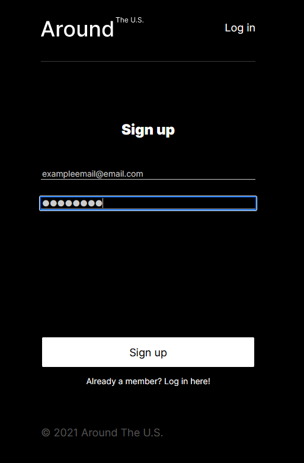
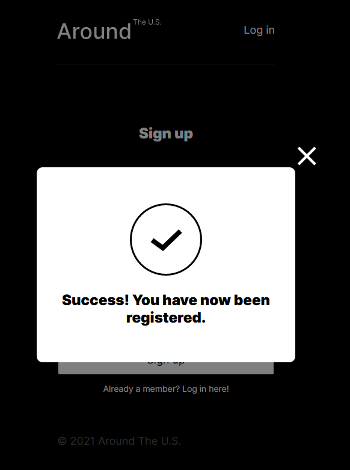
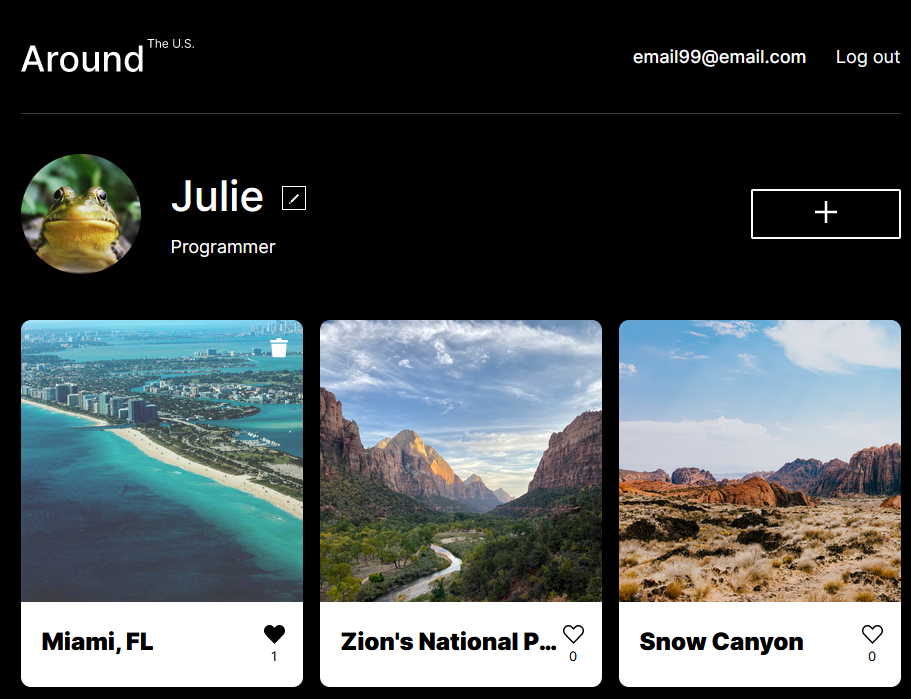

Around the U.S. project on React, featuring authorization and registration.

This repository will contain your own front-end project on React with added authorization and registration features.
Start working with your previously built front end code from Sprint 11.

All authorization, registration and token requests must go through to the server running on [https://register.nomoreparties.co](https://register.nomoreparties.co/).

Good luck!

# Pictures

